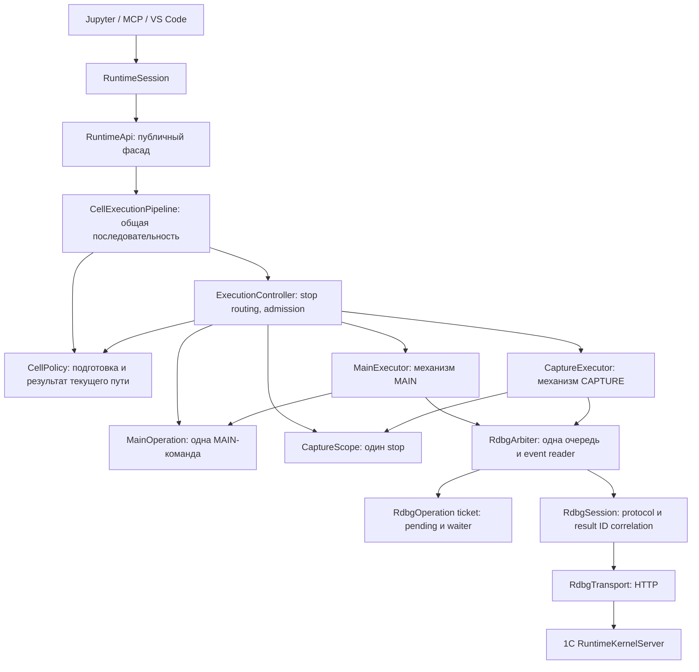

# Проект исполнения MAIN и CAPTURE

Дата: 17.09.2026. База анализа: master, 3d5db0a. Это согласованная спецификация рефакторинга MAIN/CAPTURE. Live-поведение 1С пока не подтверждено.

## 1. Результат проектирования

После рефакторинга один runtime имеет один RDBG transport/session, один `RdbgArbiter` и один `ExecutionController`. `RuntimeSession` собирает MAIN/CAPTURE route bindings, а контроллер хранит два долгоживущих механизма исполнения — `MainExecutor` и `CaptureExecutor` — и ссылки на текущие `MainOperation` и `CaptureScope`. На каждую принятую MAIN-команду создаётся `MainOperation`, живущая от dispatch до completion либо доказанной потери target. На каждую распознанную остановку этой команды создаётся `CaptureScope`, живущий от входа в CAPTURE до подтверждённого `Continue` либо потери кадра. Несколько CAPTURE-ячеек используют один `CaptureScope` и получают отдельные operation tickets. `RdbgArbiter` является единственной точкой исполнения RDBG-команд и чтения event stream во время runtime-исполнения. Внешние адаптеры продолжают вызывать `RuntimeSession.execute_bsl()`, `resume_capture()` и `status()`.

Для исполнения подготовленной ячейки действует общий контракт. Возможности чтения остановленного кадра, материализации и resume доступны через отдельный контракт CAPTURE. Текущий `CaptureEvaluationCoordinator` заменяется общим механизмом ticket/waiter внутри `RdbgArbiter`, а не переименовывается в CAPTURE executor. `RdbgSession` сохраняет RDBG XML, protocol state и корреляцию `result_id`; HTTP и сетевые ошибки принадлежат `RdbgTransport`. Arbiter не копирует protocol state сессии.

Ключевое изменение поведения: результат операции и жизнь остановленного кадра описываются независимо. Ошибка BSL, Worker, чтения переменной либо materialization может завершить соответствующий запрос с ошибкой при всё ещё пригодном CAPTURE. Кнопка Stop ячейки запрашивает прекращение её удалённого исполнения; после remote dispatch одного отсоединения waiter недостаточно. Пока отмена не подтверждена, runtime не сообщает пользователю, что код 1С остановлен. Лимит времени исполнения BSL убирается для MAIN и CAPTURE; ограничения времени отдельных сетевых запросов сохраняются.

## 2. Текущие границы, которые меняем

`RuntimeSession` создаёт `RdbgTransport`, `RdbgSession`, `PrototypeRuntimeController` и `PrototypeRuntimeApi` при bootstrap. `RuntimeApi` выбирает MAIN/CAPTURE по `controller.state` до lowering и повторяет ветвление при исполнении и helper/materialization. Контроллер содержит MAIN dispatch, capture setup, eval, frame/value inspection, materialization и resume. `CaptureEvaluationCoordinator` получает от него `dispatch/poll/restore` и policy callbacks, удерживает `result_id` и выполняет обязательное завершение операции.

Этот разрез уже содержит два источника состояния CAPTURE: `OperationState` контроллера и `CapturePhase` coordinator. `RuntimeApi.status()` сопоставляет их. Ошибки capture setup в ряде мест переводят контроллер в `FAILED` до доказательства потери остановленного кадра. `_execute_capture_transfer` вызывается из `RuntimeApi` через частный `getattr`. Основной цикл MAIN ожидает stop с фиксированным deadline и по его истечении выставляет RDBG session в `FAILED`.

Точки кода: [bootstrap](../../../src/onec_runtime/session.py#L995), [выбор mode](../../../src/onec_runtime/runtime_api.py#L3672), [ветка исполнения](../../../src/onec_runtime/runtime_api.py#L3849), [MAIN dispatch](../../../src/onec_runtime/prototype_runtime.py#L1616), [capture setup](../../../src/onec_runtime/prototype_runtime.py#L1711), [capture request](../../../src/onec_runtime/prototype_runtime.py#L3412), [сопоставление статуса](../../../src/onec_runtime/runtime_api.py#L1121), [MAIN stop deadline](../../../src/onec_runtime/rdbg/session.py#L492).

## 3. Владение и зависимости



| Владелец | Срок жизни | Его решения |
| --- | --- | --- |
| `RuntimeSession` | Один запущенный runtime | Bootstrap/shutdown процессов, transport и RDBG session; собирает MAIN/CAPTURE route bindings, controller и generic pipeline. |
| `RuntimeApi` | Один runtime | Публичный фасад BSL/status/value APIs; передаёт BSL-запрос в pipeline. Владеет либо предоставляет ports Worker/namespace сервисов; не выбирает MAIN/CAPTURE для lowering или RDBG dispatch. |
| `CellExecutionPipeline` | Один runtime | Общий parse → ожидание стабильного route → подготовка по snapshot → admission → ожидание результата. Не импортирует классы MAIN/CAPTURE и не читает `controller.state`. |
| `CellPolicy` | Один route | Готовит BSL по namespace/Worker snapshots и превращает outcome в `RuntimeReply`. MAIN/CAPTURE варианты предоставляют свои `LoweringProfile`, message/dirty-root/Worker policy; используют общий семантический обход, но не общий mutable экземпляр lowerer. |
| `ExecutionController` | Один runtime | Получает готовые route bindings; создаёт текущие MainOperation/CaptureScope, маршрутизирует stop, меняет путь исполнения, выдаёт допуск по snapshot/fence. Публичный статус агрегирует, не хранит дублирующий mutable enum MAIN или CAPTURE. |
| `MainExecutor` | Один runtime | Реализует протокол MAIN: порядок записи команды, `Continue`, ожидание stop, чтение и сверка результата MAIN. Работает с переданной `MainOperation` и возвращает stop контроллеру для классификации. |
| `MainOperation` | Одна MAIN-команда, включая все её capture stops | MAIN command ID, target, lifecycle, pending stop и терминальный результат. Остаётся живой и приостановленной во время CAPTURE. |
| `CaptureExecutor` | Один runtime | Реализует протокол CAPTURE: setup, BSL eval, inspection/materialization и resume/writeback. Работает с переданным `CaptureScope`, не хранит вторую копию его lifecycle. |
| `CaptureScope` | Один распознанный capture stop | Identity кадра, staged setup, dirty-root ledger, ресурсные долги и публичный lifecycle. Принимает несколько CAPTURE-операций; это единственный источник состояния кадра. |
| `RdbgArbiter` | Один runtime после bootstrap | Единственная очередь логических RDBG-операций и единственный event reader; хранит текущий route и одну активную операцию, управляет допуском, waiter detach и handoff MAIN↔CAPTURE. Не знает BSL policy, структуру кадра или dirty roots. |
| `RdbgOperation` / `ExecutionTicket` | Одна принятая логическая операция | Ссылка на low-level pending capability `RdbgSession`, состояние dispatch/settlement и notebook waiter. CAPTURE scope ссылается на active ticket; не хранит копию его remote phase. |
| `RdbgSession` | Один debugger UI/target | Сборка/разбор RDBG XML, target и pending capabilities, команды `evalExpr`/`modifyValue`/`step`, корреляция событий. |
| `RdbgTransport` | Один сетевой клиент | HTTP-запросы к `/e1crdbg/rdbg`, отдельные transport deadlines и сетевые ошибки. |

`RuntimeKernelServer` в 1С исполняет BSL через `Выполнить(...)`. Python executors задают путь доставки и порядок debugger-команд; `MainOperation`/`CaptureScope` хранят domain lifecycle, tickets — исход отдельных запросов. Executor получает только port арбитра и не может вызвать `RdbgSession` напрямую. После bootstrap все RDBG-команды исполнения, heartbeat/poll и cleanup проходят через один arbiter; `RdbgSession` остаётся низкоуровневым protocol client с его pending capabilities и XML/event correlation.

«Активный executor» означает выбранный **сейчас** путь исполнения, а не срок жизни Python-объекта. Оба executor могут существовать одновременно. При MAIN dispatch и ожидании stop активен путь MAIN; при CAPTURE setup/eval/inspection/writeback активен путь CAPTURE, а `MainOperation` приостановлена. После подтверждённого `Continue` из CAPTURE активен путь MAIN с **той же** `MainOperation`. В простое ни один путь не отправляет команды. Физическое право обращаться к RDBG всегда остаётся у арбитра; control-plane чтение не меняет активный путь.

Здесь нужны два инварианта: только arbiter читает debugger events и одновременно исполняется максимум одна логическая RDBG-операция. Отдельных классов/locks `EventStreamLease` и `OperationSlot` нет. Запись `CurrentRdbgActivity` также не нужна: она смешивала срок жизни route и отдельного запроса. У arbiter достаточно `current_route: RouteToken` (`MAIN/CAPTURE/READY`, opaque context ID, route epoch, context revision), `active_operation: RdbgOperation | None` и очереди. `RouteToken` меняется на границе stop/`Continue` и при изменении revision текущего scope после CAPTURE-операции; `RdbgOperation` содержит ID **запроса**, план, waiter и ссылку на pending capability `RdbgSession`, если удалённый eval ещё не завершён. ID MAIN-команды хранится отдельно в `MainOperation`. Inline helper eval остаётся внутри текущей операции. При CAPTURE idle route указывает на scope, а `active_operation=None`; при pending eval route тот же, а active operation содержит capability.

| Путь | Где находится знание об исполнении | Что хранит состояние |
| --- | --- | --- |
| MAIN | `MainExecutor`: подготовить breakpoint workspace; записать `ТекущаяИнструкция` и `ИдентификаторКоманды` через `modifyValue`; отправить `Continue`; дождаться stop; прочитать и сверить completion. Контроллер классифицирует stop. | `MainOperation`: command ID, target, текущая фаза, pending stop и итог. |
| CAPTURE | `CaptureExecutor`: подготовить остановленный кадр; построить вызов `RuntimeKernelServer.ВыполнитьКодВКонтекстеОтладки(Контекст, Код)`; отправить `evalExpr`; сопоставить `exprEvaluated`; выполнить inspection/materialization; при resume выгрузить dirty roots, очистить контекст и отправить `Continue`. | `CaptureScope`: frame identity, стадия setup, pending operation, dirty-root journal, ресурсные долги и статус кадра. |

Общий интерфейс обоих executor ограничен планом исполнения подготовленной ячейки и возвращаемым ticket. Он не требует одинаковой последовательности RDBG-команд. Pipeline организует общий parse и вызывает policy текущего route; Worker и namespace snapshots берёт у их сервисов через ports. Конкретный RDBG-протокол находится внутри executor; реальный `Выполнить` исполняет 1С.

Зависимости пакетов направлены от `execution/controller` к `execution/main` и `execution/capture` через общие contracts. Исполнители не импортируют конкретный controller и не вызывают его частные методы. `RuntimeApi` видит pipeline и отдельные status/capture ports; pipeline видит controller port и opaque `PreparationContext`, а не поля coordinator или конкретные MAIN/CAPTURE классы. Общие модели выносятся в `execution/contracts.py`, чтобы исключить цикл импортов.

## 4. Контракт исполнения

`RuntimeApi.execute_bsl(source)` остаётся публичным фасадом и вызывает один `CellExecutionPipeline.execute(source, source_unit)`. Pipeline оркестрирует общие шаги и не читает `controller.state`. Путь MAIN/CAPTURE выбирает контроллер; вместе с ним он выдаёт route-specific `CellPolicy`. Политика содержит подготовку и превращение исхода в публичный ответ; executor содержит последовательность RDBG-команд. Это разделяет три решения: **какой путь допустим** (controller), **как подготовить и представить ячейку** (policy), **как исполнить её в debugger** (executor).

| Шаг и владелец | Вход | Возврат | Побочные эффекты |
| --- | --- | --- | --- |
| `CommonCellParser.prepare(source, source_unit)` | Текст BSL и identity видимого source unit | `CommonCell` либо `SourceDiagnostic`: parsed/split cell, source maps, worker declarations, hash исходника | Не читает текущий route, namespace или Worker generation; не обращается к target. Локальный compiler cache допустим. |
| `ExecutionController.await_preparation_context()` | Нет mode-параметра; запрос на следующую BSL-ячейку | `PreparationContext` либо typed unavailable/interrupt outcome | Ждёт стабильной границы после предыдущей удалённой операции без Session/API writer locks; не резервирует RDBG на время lowering. |
| `CellPolicy.prepare(common, snapshots, context)` | `CommonCell`, `PreparationSnapshots` с двумя versioned immutable snapshot владельцев namespace/Worker и `PreparationContext` | `PreparedCell` либо `SourceDiagnostic` | Mode-specific lowering, dirty-root analysis, message policy, Worker preview по snapshots. Не публикует Worker generation, не берёт remote pin и не отправляет RDBG. |
| `ExecutionController.validate_preparation(context, guards)` | Route token и version guards после локальной диагностики policy | `Current`, `StalePreparation` или `Unavailable` | Read-only проверка; не создаёт ticket и не отправляет команду. |
| `ExecutionController.submit_cell(context, prepared, guards)` | Route-bound `PreparedCell` и порты проверки версий namespace/Worker | `Accepted(ExecutionTicket)` либо `Rejected(StalePreparation/Unavailable)` | До `Accepted` нет remote side effects. После `Accepted` arbiter владеет очередью, Worker activation/remote dispatch/cleanup и публикует outcome. |

Типы на границе generic pipeline можно описать так (это контракт, не готовые сигнатуры существующего кода):

```python
@dataclass(frozen=True)
class CommonCell:
    source_unit: SourceUnit
    parsed_units: ParsedUnits
    source_maps: SourceMaps
    source_hash: str

@dataclass(frozen=True)
class PreparationContext:
    route_token: RouteToken       # opaque для RuntimeApi/pipeline
    preparation_nonce: PreparationNonce  # новый на каждый вызов
    policy: CellPolicy            # port, выбранный controller
    capabilities: CellCapabilities

@dataclass(frozen=True)
class PreparationSnapshots:
    namespace: NamespaceSnapshot
    worker_catalog: WorkerCatalogSnapshot
    guards: SnapshotGuards        # version readers владельцев snapshots

class CellPolicy(Protocol):
    def prepare(self, common: CommonCell, snapshots: PreparationSnapshots,
                context: PreparationContext) -> PreparedCell | SourceDiagnostic: ...
    def settle(self, outcome: RemoteOutcome, prepared: PreparedCell,
               services: SettlementServices) -> RuntimeReply: ...

Admission = Accepted[ExecutionTicket] | Rejected[StalePreparation | Unavailable]
```

`RouteToken` и `PreparedCell` непрозрачны для generic pipeline: он переносит их между портами, но не извлекает `mode`, MAIN ID, capture frame или dirty roots для выбора ветки. Внутри controller/arbiter token содержит runtime generation, route epoch, context revision, владельца операции и fence; внутри policy/executor эти данные доступны через типизированный route binding. Revision увеличивается после каждой принятой CAPTURE-операции, у которой мог начаться remote side effect, даже при ошибке операции и прежней остановке; при unknown outcome route остаётся занятым до выяснения. `preparation_nonce` выдаётся отдельно на **каждый** вызов, даже если несколько вызовов получили один CAPTURE route, и служит seed для message/request identity. `SnapshotGuards` получаются из владельцев namespace и Worker catalog одновременно со snapshots; controller только вызывает проверку, не хранит их mutable catalog. `capabilities` описывают допустимые операции и требования подготовки, а не являются вторым enum для `if MAIN/CAPTURE`.

Последовательность generic pipeline:

```python
common = parser.prepare(source, source_unit)
if isinstance(common, SourceDiagnostic):
    return diagnostic_reply(common)

while True:
    context = controller.await_preparation_context()
    snapshots = snapshot_services.read_for(context.capabilities)
    prepared = context.policy.prepare(common, snapshots, context)
    if isinstance(prepared, SourceDiagnostic):
        validity = controller.validate_preparation(context, snapshots.guards)
        if isinstance(validity, StalePreparation):
            continue                    # диагностика зависела от старого route
        if isinstance(validity, Unavailable):
            return unavailable_reply(validity)
        return diagnostic_reply(prepared)
    admission = controller.submit_cell(context, prepared, snapshots.guards)
    if isinstance(admission, Rejected) and isinstance(admission.reason, StalePreparation):
        continue                        # только локальная подготовка
    if isinstance(admission, Rejected):
        return unavailable_reply(admission.reason)
    return admission.ticket.wait_initiator()  # RuntimeReply после policy.settle
```

Проверки в этом примере относятся к типам **результата операции** (`SourceDiagnostic`, `Rejected`), а не к типам route/policy. Ровно здесь проходит критерий отсутствия знания о MAIN/CAPTURE в generic коде. `snapshot_services.read_for(...)` интерпретирует декларативные requirements без проверки конкретного класса policy или значения mode. `validate_preparation` — read-only проверка тех же token/guards для mode-specific локальной ошибки; она не создаёт ticket. Если route стал недоступен, возвращается typed `Unavailable`, как и при `submit_cell`. Повтор при `StalePreparation` допустим только пока arbiter подтверждает отсутствие remote и target-mutating Worker side effects; повторное ожидание стабильного route должно парковать запрос, а не превращаться в busy loop.

`CommonCell` содержит видимый mapped source, отдельные Worker/statements units, source maps, parsed model и source hash. Он **не** содержит пониженный BSL, dirty roots или выбранный mode. Worker artifact, зависящий только от этих immutable данных, можно локально собрать заранее; preview, зависящий от текущего каталога или поколения Worker, относится к следующему шагу.

`PreparationContext` содержит opaque `RouteToken` (runtime generation, route epoch, context revision, owner/fence), отдельный одноразовый `preparation_nonce`, ссылку на `CellPolicy` и snapshot capabilities. Он не содержит публичного поля `mode`, по которому pipeline мог бы ветвиться. Для MAIN ready в нём **нет «следующего MAIN ID»**: command ID выделяется при принятии MAIN-операции, когда fence ещё раз проверен. Для CAPTURE token ссылается на уже существующий scope/fence, но pipeline их не разбирает. Controller может вернуть context только на стабильной границе: MAIN ready или подтверждённый CAPTURE idle. Пока MAIN ждёт stop, CAPTURE eval/cleanup/resume остаётся pending либо setup ещё не допускает код, вызов ждёт или возвращает typed unavailable; status и чистый Python при этом продолжают работать. Если ожидание прервано, никакой RDBG-команды и Worker activation ещё нет. Worker catalog identity и notebook namespace берутся отдельно у их владельцев, а не у контроллера.

`CellPolicy` — узкий route-specific port: `prepare(...) -> PreparedCell | SourceDiagnostic` и `settle(remote_outcome, prepared, services) -> RuntimeReply`. Здесь «общий lowerer» означает **общий семантический обход/переписывание**, а не полное отсутствие различий. В [нынешнем lowerer](../../../src/onec_runtime/bsl/semantic_lowering.py#L500) прямые ветки `LoweringMode` задают имя результирующей переменной, доступ к `КонтекстОтладки` и метку source map; запись dirty capture root связана с правилом доступа к этому namespace. Целевой контракт выносит эти решения в immutable `LoweringProfile` выбранной policy: `result_channel`, правило чтения/записи capture namespace с учётом dirty roots и `source_map_tag`. Общий обход AST получает profile, а не проверяет MAIN/CAPTURE enum. Если алгоритмы переписывания впоследствии действительно разойдутся, разделить их на две реализации будет оправданно; сейчас дублировать весь обход ради этих различий не нужно.

Нынешний `SemanticNotebookLowerer` изменяет `self._mode`, `_context`, `_exports`, `_call_exports` и после lowering `_initial_context`. Поэтому `prepare` создаёт изолированный экземпляр из immutable namespace/Worker snapshots для каждой попытки, а результат анализа кладёт в `PreparedCell`. Он не публикует эти изменения в runtime services до admission/settlement. Альтернатива при реализации — переделать lowerer в stateless сервис с per-call рабочим состоянием; совместное использование текущего mutable объекта недопустимо. `CellExecutionPipeline` и `RuntimeApi` не импортируют `LoweringMode` или `LoweringProfile` и не проверяют тип конкретной policy.

`settle` выполняется owner операции даже после detach notebook waiter: он фиксирует namespace/result policy и завершает локальную обработку результата до публикации финального reply. Обязательные RDBG restore/cleanup остаются в `ExecutionPlan` исполнителя под владением arbiter, а не в generic pipeline или policy. Если различия в подготовке сведутся к параметрам lowerer, MAIN/CAPTURE policy могут быть immutable profile values вместо двух классов; они всё равно задают mode и создают отдельное рабочее состояние на вызов.

`PreparedCell` содержит `RouteToken`, `preparation_nonce`, версии namespace/Worker catalog, lowered source или template для позднего Worker binding, source maps, вычисленный namespace delta, dirty roots, message collection plan, Worker activation intent и metadata для diagnostics/settlement. Это одноразовый локальный продукт подготовки, **не** уже отправленная команда. Он может устареть во время долгого lowering: `submit_cell` сверяет token, nonce и версии перед admission и атомарно помечает nonce использованным. Повторная подача того же `PreparedCell` отклоняется без нового dispatch. Устаревший объект отклоняется без RDBG и target-mutating Worker effects; pipeline может заново подготовить тот же `CommonCell` по новому snapshot и новому nonce.

`Accepted(ExecutionTicket)` означает, что arbiter создал запись логической операции **до** входа в transport, но не гарантирует, что RDBG-команда уже отправлена. Ticket различает `queued`, `dispatch_entered`, `pending`, `stop_requested`, `settled` и `outcome_unknown`. Stop до первого побочного эффекта удаляет queued запрос; после Worker activation или входа в transport он запрашивает прекращение удалённой работы по правилам раздела 7. Waiter может отсоединиться, но это не является подтверждением остановки 1С. Ошибка Worker activation после `Accepted` уже является исходом принятой операции: её нельзя описывать как «отказ до побочных эффектов» или автоматически повторять при неизвестном результате. Проверка route/fence и версий выполняется повторно непосредственно перед первым target side effect; arbiter сериализует user dispatch, но не обещает остановить внешние изменения target между проверкой и сетевым запросом.

`guards` — ports чтения текущих версий namespace/Worker service, а не копия их mutable состояния в controller. Проверка при `submit_cell` выполняется до `Accepted`; если принятый запрос стоял в очереди, arbiter повторяет её после dequeue вне mailbox lock. Изменение версии до первого side effect завершает ticket как `StalePreparation` без RDBG и допускает повтор локальной подготовки. Все runtime-операции, способные менять эти версии, должны проходить через тот же single-writer admission boundary; иначе обещать атомарность между проверкой и dispatch нельзя. После первого side effect автоматический повтор по одному факту изменения версии запрещён.

`CellExecutionPipeline` передаёт owner-ам версий `NamespaceSnapshot` и `WorkerCatalogSnapshot` через ports; он не захватывает RDBG queue во время parse/lower/preview. Между подготовкой и dispatch действуют оптимистические version checks. Если для Worker publication нужны дополнительные runtime locks, они берутся на короткой стадии принятой операции и не удерживаются во время ожидания RDBG outcome. Полное lowering до `await_preparation_context` невозможно: текущий код использует разные `LoweringMode`, namespace и Worker catalog.

Публичный `RuntimeApi.execute_bsl(...)` возвращает привычный `RuntimeReply` после `ExecutionTicket.wait_initiator()`; `CellExecutionPipeline.execute(...)` имеет тот же результат. При `SourceDiagnostic` формируется обычный source-failure reply без принятой удалённой операции. `Rejected(StalePreparation)` заставляет pipeline получить новый `PreparationContext` и повторить только локальную подготовку; `Rejected(Unavailable)` отдаёт типизированную причину вызывающему. Если notebook waiter прерван после `Accepted`, pipeline передаёт arbiter `request_stop(ticket)`; arbiter снимает ещё не начатый queued запрос либо начинает remote stop. Отсоединение waiter не выдаётся за успешную отмену. Финальный `CellPolicy.settle` остаётся обязанностью owner, если операция завершилась до подтверждённой остановки.

**Критерий приёмки: generic BSL путь не знает набор режимов.**

1. `RuntimeApi.execute_bsl` только делегирует pipeline; `RuntimeApi` и `CellExecutionPipeline` не импортируют `LoweringMode`, `OperationState`, `MainExecutor`, `CaptureExecutor` или concrete MAIN/CAPTURE policy. В generic BSL пути нет `if mode`, `isinstance` по режиму и `getattr` для выбора частного метода.
2. Controller может знать MAIN/CAPTURE для классификации stop, создания `MainOperation`/`CaptureScope` и выбора route. Он не lower-ит BSL, не строит `Выполнить...` expression, не форматирует message/Worker результат.
3. MAIN/CAPTURE `CellPolicy` знают различия lowering, dirty roots, messages, Worker binding и settlement. Общий semantic lowerer принимает route-specific `LoweringProfile`; добавление профиля не требует менять общий обход AST или `CellExecutionPipeline`. MAIN/CAPTURE executor знают разные RDBG последовательности. Arbiter знает только очередь, capability и event routing.
4. Контрактный тест подставляет третью fake policy и fake executor через route binding: `RuntimeApi.execute_bsl` и `CellExecutionPipeline` проходят parse → prepare → submit → settle без правки их кода. Для реального третьего режима дополнительно нужны правила переходов controller и публичные capabilities; этот тест не обещает plug-in режим «одним классом».
5. Отказ до `Accepted` не меняет target/Worker generation. После `Accepted` любой неоднозначный побочный эффект отражается в ticket/recovery record; pipeline не повторяет запрос по одному exception. Pending CAPTURE eval блокирует зависимую подготовку до settlement, но не блокирует `status()` и чистый Python.
6. Тест stale route между `await_preparation_context` и `submit_cell`, stale Worker/namespace generation и context revision в очереди подтверждает отказ до первого side effect; тест Worker activation после `Accepted` подтверждает, что его ошибка/unknown outcome остаётся на ticket. Конкурентная подготовка двух ячеек не создаёт двух одновременно активных RDBG операций, не повторно использует message identity и не смешивает mutable состояние lowerer.

Публичные команды `resume_capture()` и доступ к CAPTURE frame по определению являются capability-specific API; их явная типизированная маршрутизация не нарушает этот критерий. Публичное поле mode в `RuntimeStatus` тоже допустимо как данные для пользователя; запрещён выбор способа исполнения generic BSL по этому полю внутри `RuntimeApi`.

Общий минимальный `CellExecutor` реализует `build_plan(context, prepared) -> ExecutionPlan`, где context — текущая `MainOperation` или `CaptureScope`, сверенная контроллером по `RouteToken`. Исполнитель не хранит «текущую ячейку» как собственный mutable lifecycle. Для MAIN контроллер создаёт operation при admission и передаёт её в `MainExecutor`; для CAPTURE он передаёт существующий scope в `CaptureExecutor`. `controller.submit_cell` передаёт план арбитру и возвращает его `ExecutionTicket`. Arbiter выполняет построенную executor последовательность RDBG через единственный `RdbgSession`. Ticket представляет конкретную ячейку/удалённую операцию независимо от ожидания вызывающего notebook: `wait_initiator()`, `request_stop()`, внутренний `detach_waiter()` и `status()`. Результат является tagged union `MainYield.Completed`, `MainYield.CaptureStopped`, `MainYield.UserBreakpoint` либо CAPTURE cell outcome. Route-specific `CellPolicy.settle` адаптирует его к существующим `RuntimeReply` и `CaptureView`. У MAIN и CAPTURE разные алгоритмы dispatch; их результат не приводится к ложному общему «скалярному значению».

MAIN ticket становится `settled` на **первом** debugger stop этой ячейки: completion, user breakpoint или CAPTURE point. При CAPTURE point исходная notebook-ячейка получает `CaptureView`, но `MainOperation` остаётся `suspended_capture` до следующего resume/stop и своего `terminal` исхода. CAPTURE ticket становится `settled` после своего `exprEvaluated` и обязательного cleanup; его результат не закрывает `CaptureScope`. Поэтому `ticket.settled` никогда не трактуется как `MainOperation.terminal`.

`CaptureExecutor` отдельно реализует `CaptureCapabilities`: `resume(scope)`, `inspect_frame(scope)`, `execute_helper(scope)/transfer(scope)` и работу с локальными value handles. `MainExecutor` предоставляет управление допустимым user debug stop через `MainOperation`. Эти методы не входят в `CellExecutor` как заглушки. Наружу остаются команды `RuntimeSession`/`RuntimeApi`, поэтому Jupyter не знает конкретный класс исполнителя.

Для MAIN и CAPTURE owner удалённой операции сохраняется и после Stop notebook-ячейки: он сопоставляет поздний debugger outcome либо доказательство termination. Это требуется и MAIN после подтверждённого `Continue`: прерывание Python-ожидания не может оставить следующее событие stop без владельца. Ограничение времени исполнения кода не используется; `wait_initiator` может быть прерван, а `status` различает `stop_requested`, `stop_confirmed` и `stop_unknown`.

## 5. Создание и смена исполнителя

1. При запуске контроллер имеет оба executor, но не содержит текущей MAIN-команды или CAPTURE-остановки. Когда подготовленная MAIN-ячейка проходит резервирование и допуск, он создаёт `MainOperation` для неё и передаёт её в `MainExecutor`. Operation владеет command ID, pending stop и терминальным результатом до завершения команды.
2. `MainExecutor` возвращает debugger stop вместе с `MainOperation`. Контроллер классифицирует его относительно её operation ID и установленных точек.
3. При распознанной точке CAPTURE контроллер создаёт `CaptureScope` **до** удалённого setup с fence из runtime generation, ожидаемого MAIN ID, target ID и evidence остановки. Arbiter атомарно меняет `current_route` с MAIN operation на scope; отдельного lease/slot handoff нет. Scope уже владеет частично выполненной подготовкой. `CaptureExecutor.open(scope)` задаёт план проверки command/frame evidence, чтения locals, переноса контекста и открытия `КонтекстОтладки`. MAIN ticket становится `settled` с `CaptureView` после успешного setup либо с ошибкой setup при сохранённых MAIN operation и scope. После settlement setup очередь допускает следующую CAPTURE-операцию, но route остаётся у scope. Только после успешного открытия становятся доступны user eval, inspection и resume.
4. При подтверждённой ошибке setup и прежней остановке scope остаётся в `setup_failed` с записью завершённых шагов. Восстановление повторяет либо продолжает конкретный безопасный шаг после сверки target/frame; полный setup не повторяется вслепую. При недоказанной identity операции над кадром закрыты до повторной проверки.
5. После успешного открытия CAPTURE становится текущим путём исполнения, а родительская `MainOperation` остаётся `suspended_capture`. Пока есть pending eval, новый CAPTURE запрос ожидает исход прежнего; независимый Python-код и read-only control plane могут работать. Прерывание ожидающего нового запроса удаляет только его очередь ожидания и не создаёт RDBG-команду.
6. При resume старый кадр остаётся под владением `CaptureScope` во время writeback. Подтверждённый `Continue` немедленно делает frame-backed handles stale; arbiter атомарно меняет `current_route` на родительскую `MainOperation`, которая возвращается к ожиданию stop через `MainExecutor`. Текущая `active_operation` остаётся принятой до этого stop; новый dispatch не допускается. Инициатор `resume_capture()` может продолжать ждать следующий stop через её ticket; Stop ячейки запрашивает остановку уже продолжающегося target по общим правилам раздела 7. Контроллер затем принимает MAIN completion, обычный debug stop или новую точку CAPTURE. Неизвестный исход `Continue` оставляет route, active operation и журнал за scope для выяснения; автоматического возврата к MAIN нет.
7. При доказанной потере target scope становится stale. Pending capability/pin получает закрытие или карантин по фактическому исходу transport; scope не удаляется, пока ему принадлежит неразрешённая удалённая операция.

Здесь есть родительская MAIN-операция и максимум один текущий CAPTURE-контекст. При MAIN completion, подтверждённом завершении с BSL-ошибкой или доказанной потере target `MainOperation` получает терминальный outcome и освобождает свои leases; следующая MAIN-ячейка получает новую operation с тем же `MainExecutor`. Стек исполнителей произвольной глубины не вводится: последующая точка CAPTURE после resume создаёт новый `CaptureScope` с тем же `CaptureExecutor`, а не вложенный scope. Python-ячейка notebook не создаёт ни `MainOperation`, ни `CaptureScope`; речь идёт о принятых BSL-командах и debugger stops.

Пример: MAIN-ячейка A создаёт `MainOperation#17`. Её первый CAPTURE stop создаёт `CaptureScope#1`, через который последовательно проходят CAPTURE-ячейки B и C. После resume scope #1 закрыт, а operation #17 продолжает ожидать stop. Следующий CAPTURE stop той же MAIN-команды создаёт `CaptureScope#2`. Новую `MainOperation#18` можно создать после терминального исхода #17.

`MainOperation` «живёт» как запись о незавершённой **команде 1С**, а не как всё ещё выполняющийся Python-вызов notebook. При CAPTURE stop исходный запрос MAIN-ячейки уже может вернуть `CaptureView`, но стек 1С остаётся остановлен внутри `Выполнить(ТекущаяИнструкция)`. Ядро запишет `ЗавершеннаяКоманда = ИдентификаторКоманды` только после возврата из этого вызова. Поэтому после resume ожидается completion с тем же command ID. В текущем коде этому соответствуют [цикл 1С](../../../onec/OnecInteractiveRuntime/CommonModules/RuntimeKernelServer/Ext/Module.bsl#L118), [`active_operation` контроллера](../../../src/onec_runtime/prototype_runtime.py#L1589) и [проверка completion ID](../../../src/onec_runtime/prototype_runtime.py#L3985).

Только worker арбитра вызывает `pingDebugUIParams` и другие методы `RdbgSession` во время исполнения. На CAPTURE stop arbiter меняет `current_route` с MAIN operation на scope; при подтверждённом `Continue` — обратно. Смена route и состояния `active_operation` происходит одной транзакцией внутри арбитра. При неизвестном исходе `Continue` route остаётся связанным со scope, пока outcome не выяснен. Отдельный reader не запускается.

## 6. Состояние MAIN и CAPTURE

`MainOperation` хранит command ID, source identity, ожидаемый target, worker lease и результат. Её фазы: `admitted` → `dispatching` → `awaiting_stop`; stop переводит её в `suspended_capture`, `suspended_user_breakpoint` либо `completed`. После resume CAPTURE та же MAIN operation возвращается к `awaiting_stop`. Подтверждённая ошибка выполнения BSL при completion является терминальным исходом MAIN-команды, после которого можно начать следующую команду. Неизвестный исход `Continue`/transport переводит команду в `outcome_unknown` до проверки; он не равен BSL failure. Подтверждённая потеря target переводит её в `lost`. Контроллер не копирует эти фазы в собственный enum.

`CaptureScope` хранит identity остановки и набор независимых domain-фактов. Состояние текущей удалённой команды принадлежит ticket в arbiter и только **проецируется** в snapshot scope:

| Измерение | Значения | Что означает |
| --- | --- | --- |
| `frame_identity` | `confirmed`, `unverified`, `lost` | Доказана ли прежняя остановка того же target и MAIN. `lost`/принятый `Continue` делает старые frame handles stale; `unverified` требует повторной проверки. |
| `context` | `opening`, `ready`, `setup_failed`, `closing`, `closed` | Создан ли и доступен ли `КонтекстОтладки`; ошибка setup не меняет `frame_identity` без отдельного доказательства. |
| `active_ticket` | `None` или ID ticket в arbiter | Scope не хранит отдельную копию `dispatch_unknown/pending/result_id`. `remote_operation` в публичном snapshot вычисляется из этого ticket. |
| `last_operation` | `succeeded`, `failed`, `unknown` | Исход пользовательской ячейки, inspection или materialization. `failed` не изменяет автоматически identity кадра. |
| `writeback` | `clean`, `flushing`, `partial`, `unknown`, `complete` | Какие roots подтверждённо записаны в исходный кадр; после `partial`/`unknown` полный resume нельзя повторить. |
| `resource_debts` | типизированный набор | Невосстановленные breakpoint workspace, temporary key, Worker pin или другие leases. Каждый долг блокирует только зависимые действия. |

В API выдаётся один immutable, bounded и redacted `CaptureSnapshot` из текущего scope. Из фактов вычисляются `can_execute_bsl`, `can_inspect`, `can_materialize` и `can_resume` с причиной отказа. Эти признаки не хранятся независимо. `RuntimeStatus` агрегирует MAIN/CAPTURE snapshot и не переводит `last_operation.failed` в глобальный `FAILED`. На время миграции прежний `CaptureStatus.phase` можно вычислять для совместимости, но допуск должен использовать новые факты, а не старый enum. Коды ошибок и сообщения остаются ограниченными по размеру и не раскрывают значения локальных переменных.

Живость кадра не определяется одним булевым «target stopped». `CaptureFence` как внутренний immutable value object разделяет `runtime_generation`, target ID/тип, ожидаемый MAIN command ID и доступное **remote evidence** остановки (`stateNum` target, location/stack при наличии) от `local_stop_sequence` для устаревания локальных handles. В текущем `StopEvent` нет гарантированного уникального remote stop token; локальная последовательность не доказывает, что после неоднозначного `Continue` перед нами прежняя физическая остановка. Повторный stop в той же location — ABA-сценарий. `open()` сверяет MAIN ID в kernel frame. После ambiguous transport проверка идёт через RDBG без `Continue`; если evidence не исключает промежуточный resume/re-stop, identity остаётся `unverified` и frame-backed действия закрыты. `status()` сообщает последнее доказанное состояние; отдельный refresh или следующая операция могут инициировать revalidation. Нет требования непрерывно опрашивать target в отсутствие операции.

| Событие | MAIN | CAPTURE | Допуск |
| --- | --- | --- | --- |
| Новый MAIN-код принят | Создаётся MainOperation, `dispatching` | Нет | Второй MAIN-запрос ждёт освобождения arbiter либо получает занятость. |
| `Continue` MAIN подтверждён | `awaiting_stop` | Нет | Новый код не отправляется; stop принадлежит этой MainOperation. |
| Stop на CAPTURE point | `suspended_capture` | Создаётся, `opening` | Доступен только status и контролируемый setup/retry. |
| `open()` успешен | `suspended_capture` | `confirmed/ready/idle` | CAPTURE BSL, inspection, materialization, resume по ресурсным условиям. |
| `open()` дал подтверждённую ошибку | `suspended_capture` | `setup_failed` при сохранённом кадре | Исправление/повтор конкретного setup шага; новый MAIN не запускается. |
| CAPTURE eval отправлен | `suspended_capture` | `pending(result_id)` | Другие CAPTURE операции ждут; Python/status доступны. |
| BSL/Worker/materialization ошибка с подтверждённым исходом | `suspended_capture` | `ready`, `last_operation.failed` | Следующая операция по отдельным ресурсным условиям. |
| Stop notebook-ячейки при pending CAPTURE eval | Родительская MAIN остаётся suspended до исхода stop | `stop_requested`; owner сохраняет pending capability до исхода eval либо termination | Новые CAPTURE вызовы не отправляются; успешная остановка по текущим возможностям может закрыть весь target и scope. |
| Resume до `Continue`, writeback частичен | `suspended_capture` | `partial` или `unknown` | Адресное восстановление, без повторного полного resume. |
| `Continue` resume подтверждён | `awaiting_stop` | Старый кадр `closed/stale` | Ожидание следующего stop; старые handles не работают. |
| `Continue` resume неизвестен | `outcome_unknown` | `unverified`/запись журнала | Проверить target и stop/MAIN identity; никакого слепого повтора. |
| Target доказанно потерян | `lost` | `lost` | Старый контекст недоступен. |

Если MAIN `Continue` отправлен, `MainOperation` владеет следующим stop даже после утраты вызывающего waiter. Пользовательский Stop при этом запускает прекращение target по разделу 7; технический detach waiter без пользовательского Stop оставляет ожидание. Ticket виден через status/wait, а следующий MAIN-код не обходит незавершённую команду. Событие завершения MAIN — debugger stop, CAPTURE eval — `exprEvaluated` с `result_id`.

Допустимая конкурентность для разных стадий (`queue` означает ожидание без владения API/Session writer lock):

| Запрос | MAIN ждёт stop | CAPTURE idle | CAPTURE eval pending | CAPTURE resume | Чистый Python |
| --- | --- | --- | --- | --- | --- |
| `status()` по локальному snapshot | да | да | да | да | да |
| Чистый Python без runtime proxy | да | да | да | да | да |
| Новая BSL-ячейка без закреплённого mode | ждёт stop/исхода, затем получает route | выполняется как CAPTURE | queue | ждёт следующего route | по текущему route |
| Явно MAIN BSL | ждёт terminal MAIN | нет | нет | нет | да при MAIN-ready |
| CAPTURE BSL | нет до CAPTURE stop | да | queue | нет | да при CAPTURE-ready |
| `variables` / inspection / materialization | нет до CAPTURE stop | да | queue | нет | да при CAPTURE-ready |
| `resume_capture()` | нет | да | queue | нет | да при CAPTURE-ready |

Python-код, который обращается к CAPTURE value proxy или `to_df()`, считается удалённой CAPTURE-операцией и проходит через arbiter; строка «чистый Python» к нему не относится. В состоянии unknown outcome очередные mutating запросы не продвигаются, даже если инициирующий waiter уже отсоединён.

## 7. Interrupt, очередь и время ожидания

Здесь Stop означает кнопку остановки выполняющейся notebook-ячейки VS Code или соответствующий interrupt kernel/`KeyboardInterrupt`. Frontend может доставить это как cancellation либо interrupt; pipeline нормализует сигнал в `request_stop(ticket)`. Пользователь вправе ожидать, что проведение документов после Stop не будет молча продолжаться. Поэтому Stop — запрос прекратить **удалённое исполнение ячейки**, а не только скрыть её результат. Кнопки Restart Kernel и Stop debug session имеют другие последствия. Граница политики — `Accepted` и первый возможный побочный эффект:

| Стадия в момент Stop | Судьба ячейки | Судьба runtime |
| --- | --- | --- |
| Parse, ожидание route или локальная подготовка до `Accepted` | Вызов ячейки завершается отменой; локальный результат отбрасывается | Нет remote operation, target/Worker generation не меняются. |
| `Accepted`, но операция доказанно ещё `queued` и не начался Worker activation/transport | Arbiter атомарно снимает запрос из очереди и помечает ticket `cancelled_before_effect` | Созданная MAIN operation завершается как локально отменённая; CAPTURE scope остаётся тем же. |
| Worker activation либо вход в transport уже начались, исход ещё неизвестен | Ячейка получает «остановка запрошена», не ложное «исполнение остановлено» | Arbiter удерживает ticket/leases, блокирует новый dispatch, выясняет факт отправки и инициирует безопасную остановку либо teardown target. |
| MAIN после принятого `Continue` | Ячейка больше не ждёт прежний результат | Arbiter немедленно начинает stop path для этой `MainOperation`; поздний stop/результат сопоставляется ей, пока target не доказанно завершён. |
| CAPTURE `evalExpr` pending | Ячейка больше не ждёт прежний результат | Arbiter немедленно начинает stop path для текущего eval. Если он уже завершился до stop dispatch, обязательные restore/cleanup выполняются и scope может сохраниться; иначе при отсутствии доказанной точечной отмены завершается target и scope теряется. |
| CAPTURE resume уже начал writeback/`Continue` | Ячейка получает «остановка запрошена» | Owner сохраняет ledger частичного writeback; после принятого `Continue` действует stop path для target. Запись уже изменённых roots и внешние эффекты не откатываются автоматически. |

Пока остановка не подтверждена, статус показывает `stop_requested` или `stop_unknown`, а новые BSL/CAPTURE вызовы не отправляются. `status()` и чистый Python доступны. Python-ячейка с `to_df()`, value proxy или другим RDBG-вызовом подчиняется тем же правилам удалённой операции; чистый Python без runtime proxy прерывается обычным способом. Уже совершённые побочные эффекты 1С, включая отдельно зафиксированные документы, Stop не откатывает. Без Stop долгая команда остаётся pending без фиксированного execution timeout; связь/target проверяются отдельными ограниченными transport-запросами.

Это изменение поведения обеих веток: [текущий `_execute_main`](../../../src/onec_runtime/prototype_runtime.py#L1616) ловит `BaseException`, включая `KeyboardInterrupt`, и при отсутствии распознанного stop может перевести контроллер в `FAILED`; текущий CAPTURE [отсоединяет waiter](../../../src/onec_runtime/capture_evaluation.py#L1534) и оставляет принятую операцию своему worker. Новый arbiter сохраняет owner pending результата, но дополнительно обрабатывает Stop как намерение прекратить удалённую работу. Внутренний detach всё ещё нужен при утрате вызывающего waiter, однако не является реализацией пользовательской кнопки Stop.

Технически low-level `PendingEvaluation` остаётся в `RdbgSession` до сопоставленного результата либо доказанного завершения target; ticket арбитра владеет им после Stop. Новый запрос к тому же CAPTURE может выполнить общий parse, затем ждёт стабильного `PreparationContext` **до route-specific lowering, Worker activation и remote dispatch**, не удерживая Session/API writer locks. После получения context и локальной подготовки admission заново проверяет frame identity, context readiness, Worker generation и fence. Control-plane `status()/wait()` и независимый Python-код не ждут arbiter.

Для MAIN действует то же разделение: после принятого `Continue` его owner ждёт stop независимо от исходного notebook waiter. Фиксированный 90-секундный предел **времени исполнения BSL** и переход RDBG session в `FAILED` по одному долгому ожиданию stop удаляются. Каждый HTTP/ping/RDBG request остаётся ограниченным по времени, а polling идёт интервалами. Сетевой timeout означает проблему отдельного запроса и классифицируется по тому, могла ли удалённая команда уже начаться. Он не означает, что BSL завис или остановленный кадр утрачен.

Это не предоставляет отмену выполняющейся MAIN-команды. [Цикл 1С](../../../onec/OnecInteractiveRuntime/CommonModules/RuntimeKernelServer/Ext/Module.bsl#L118) находится внутри `Выполнить(ТекущаяИнструкция)` до возврата или BSL-исключения. В текущем [RDBG-клиенте](../../../src/onec_runtime/rdbg/session.py#L984) нет команды «прервать только этот `Выполнить` и сохранить `Контекст`»: `set_breakpoints` допускается лишь до исполнения или на уже остановленном target, а `terminateDbgTarget` используется для teardown привязанной 1С-сессии. Предустановленный breakpoint может дать stop, но сам по себе не завершает MAIN-команду и не откатывает её эффекты.

Реализация Stop сначала атомарно фиксирует `stop_requested` и закрывает новый remote dispatch, затем пытается прекратить выполнение текущей команды. Точечная отмена `evalExpr` или `Выполнить` была бы предпочтительна, если её возможность и сохранность frame будут доказаны живым тестом для используемой версии платформы. Текущий RDBG-клиент такого API не реализует; [Pause в 1C:EDT](https://1c-dn.com/library/tutorials/1c_enterprise_development_tools_user_guide/) лишь приостанавливает исполнение на строке и не доказывает отмену вызова, тогда как Terminate завершает debug session. Эта документация UI не доказывает конкретный wire contract RDBG. При нынешних возможностях после удалённого dispatch Stop должен **без дополнительного пользовательского действия** начинать завершение привязанного target. 30 секунд могут ограничивать ожидание подтверждения termination и служить порогом диагностики/эскалации, но не должны быть задержкой перед первой попыткой остановить массовое проведение. Если завершение команды пришло до отправки stop target, arbiter фиксирует фактический исход и может сохранить сессию; после отправки termination нельзя обещать сохранение CAPTURE frame.

Отдельная команда «Продолжать в фоне/не ждать» может быть добавлена для тех, кто действительно хочет оставить удалённую работу без notebook waiter; она не является поведением Stop. Успех Stop публикуется только после подтверждения отсутствия прежнего выполняющегося target либо доказанной точечной отмены. При неизвестном исходе статус прямо сообщает «остановка не подтверждена, код 1С может ещё выполняться», старый runtime закрыт для новых команд, а новый не объявляется готовым. Если live-тест не подтверждает прекращение выполняющегося target через доступный teardown, семантику Stop нельзя объявлять реализованной одной лишь отменой notebook waiter. Завершение target не гарантирует откат уже зафиксированных изменений.

После Stop, который доказанно завершил старый target, владелец runtime **автоматически** запускает новый 1С-сеанс/target в том же Python kernel; отдельная команда пользователя не требуется. Новый runtime публикуется только после доказанного завершения старого target и его RDBG reader; поздние события старого incarnation не могут попасть в новый arbiter. Если termination не подтверждён, состояние `stop_unknown/reset_pending` остаётся наблюдаемым, старые capabilities отозваны, а автоматический bootstrap нового target запрещён. При ошибке bootstrap статус остаётся `unavailable` с диагностикой; старые прокси не оживают. Teardown должен иметь независимый control-plane путь: [сейчас `RuntimeSession.execute_bsl`](../../../src/onec_runtime/session.py#L1228) держит `_operation_lock` во время ожидания MAIN, а [supervised close](../../../src/onec_runtime/session.py#L2534) ждёт тот же lock. После удаления execution timeout такая схема могла бы ждать бесконечно. Arbiter передаёт исключительное право на RDBG teardown без второго event reader и без ожидания notebook/API writer lock. Текущий [`InteractiveRuntimeSession.start`](../../../packages/jupyter/src/onec_runtime_jupyter/session.py#L39) вызывает close предыдущего владельца, но не проверяет его terminal `is_closed` перед запуском нового; этот путь не используется как доказательство корректного auto-reset.

Инвалидация охватывает `OnecValueProxy`, `CaptureView` и дочерние value descriptors, Worker generation handles/pins, table/materialization handles, tickets, source/inspection fences и MCP proxy registry. Каждая remote-bound ссылка получает уникальный `runtime_incarnation_id` (или монотонный epoch владельца), проверяемый **до** доступа к target; одного числового `runtime_generation` недостаточно, если оно снова равно `1` после нового bootstrap. При повторной установке runtime Jupyter заменяет BSL-прокси в namespace, сохраняя независимые Python-значения; старые прокси, сохранённые под другими Python-именами, должны стабильно выдавать stale/closed. Уже материализованные Python-данные остаются обычными значениями.

Существующая защита частична: [`OnecValueProxy`](../../../packages/jupyter/src/onec_runtime_jupyter/extension.py#L373) хранит weakref на конкретный `RuntimeSession` и сверяет runtime/context generation, а [`install_runtime`](../../../packages/jupyter/src/onec_runtime_jupyter/extension.py#L523) заменяет/удаляет старые BSL-прокси в namespace. [MCP registry](../../../packages/mcp/src/onec_runtime_mcp/agent/proxies.py#L768) умеет отзывать прокси по runtime ID и generation. Но [bootstrap контроллера](../../../src/onec_runtime/session.py#L1122) не задаёт новое глобально уникальное числовое поколение: значение по умолчанию снова `1`. Эти механизмы защищают обычную замену **объекта** RuntimeSession, но не доказывают безопасность in-place reset или auto-reset при незавершённом старом target. Перед реализацией auto-reset нужны отдельные integration tests на пересечение двух поколений и сохранённые Python aliases.

RDBG-клиент сохраняет capability до сопоставленного результата либо доказанного завершения target. Сейчас `_start_evaluation_request()` удаляет локальный pending при исключении отправки, хотя после входа в transport команда могла попасть в 1С. Новый record создаётся до transport entry и сохраняет target, result ID, request/fence и факт отправки даже при неизвестном HTTP-исходе. Поздний `exprEvaluated` может разрешить этот record. До разрешения исхода нельзя отправить второй eval в тот же target/context или `Continue`. `getDbgTargetState` помогает наблюдать target, но сам по себе не доказывает завершение конкретного eval. Отмена одного `evalExpr` по ID в текущем клиенте отсутствует; `terminateDbgTarget` — путь завершения target, а не точечная отмена выражения.

Если после неизвестной отправки событие никогда не придёт, протокол может не дать доказательства, была ли команда принята. Без пользовательского Stop статус остаётся `outcome_unknown`, обычные CAPTURE-вызовы закрыты, а пользователь может выбрать завершение target. При Stop arbiter сам начинает teardown; если его результат тоже неизвестен, он не объявляет ни остановку кода, ни готовность нового сеанса. Проект не обещает автоматическое восстановление без достаточного RDBG evidence и не превращает ожидание в искусственный execution timeout.

Все runtime-операции через один RDBG session сериализованы arbiter. Его worker продолжает интервальный polling после detach; возможность ленивого получения результата допускается только после отдельного доказательства сохранности RDBG-событий. Для этого проекта не требуется менять polling на ленивую модель. Arbiter mailbox lock защищает только очередь, `current_route` и `active_operation`: под ним запрещены transport I/O, Worker activation, user callbacks и ожидание результата. `RuntimeSession`/`RuntimeApi` освобождают свои writer locks до ожидания arbiter; arbiter не вызывает API callbacks под mailbox lock. Если локальная подготовка требует вложенных locks, порядок фиксируется как Session state → API writer → Worker generation; захват arbiter mailbox из этой цепочки запрещён.

## 8. CAPTURE setup, операции и writeback

`CaptureExecutor.open(scope)` обновляет журнал стадий в `CaptureScope`: stop принят, locals прочитаны, структура перенесена во временное хранилище, kernel frame найден, ID MAIN сверен, `КонтекстОтладки` создан. Каждая стадия имеет подтверждённый/неизвестный исход и свои cleanup leases. Повтор возможен только с учётом уже выполненных стадий и подтверждённой прежней остановки. Ошибка чтения locals либо поиска frame завершает setup-запрос, но не равна потере target.

Пользовательский CAPTURE BSL выполняется через `evalExpr(RuntimeKernelServer.ВыполнитьКодВКонтекстеОтладки(Контекст, Код))`. Понижение отмечает прямые присваивания `КонтекстОтладки.Имя = ...` как dirty roots. После подтверждённого исполнения — в том числе результата BSL с ошибкой — root names учитываются в ledger. Если исход eval неизвестен, ledger помечается неопределённым и дальнейший resume закрыт до выяснения. Изменение содержимого изменяемого объекта по ссылке может повлиять на исходный кадр уже во время eval; эта семантика не объявляется отложенным writeback.

Inspection, чтение `variables` и materialization идут через ту же arbiter queue и тот же fence, что CAPTURE BSL. `RuntimeApi` отвечает за публичную политику значения, ограничение payload, преобразование в Python/DataFrame и notebook namespace. `CaptureExecutor` задаёт протокол удалённых шагов: создание/чтение/очистка временного ключа и восстановление breakpoint workspace; scope хранит допуск, identity и leases. Подтверждённая ошибка admission, декодирования, `to_df()` или BSL helper завершает **операцию**, сохраняя кадр. Ошибка удаления временного ключа становится `cleanup_debt` этого ключа; неизвестный исход RDBG cleanup сначала требует установить, завершилась ли команда. Ошибка освобождения Worker pin учитывается по поколению Worker и блокирует зависящие от него вызовы, но сама по себе не доказывает потерю кадра.

`resume()` сначала проверяет frame identity, отсутствие pending eval, допустимость workspace и текущий writeback ledger. Для каждого dirty root:

1. Отдельный `evalExpr` вызывает `ПоместитьЗначениеКонтекстаОтладки(Контекст, Имя)` и возвращает адрес temporary storage.
2. Отдельный RDBG `modifyValue` записывает `ПолучитьИзВременногоХранилища(Адрес)` в исходную локальную переменную кадра.
3. Журнал фиксирует intent, отправку и подтверждённый либо неизвестный исход каждого root.

После всех roots отдельный `evalExpr` удаляет `КонтекстОтладки`, затем отдельный `step/Continue` запускает MAIN. Подтверждённая ошибка выгрузки первого root до первой записи оставляет кадр paused и позволяет исправить причину. После частичной либо неизвестной записи повтор полного resume запрещён: восстановление работает с точным root journal. Подтверждённый `Continue` немедленно инвалидирует старые CaptureView/value handles. При неизвестном исходе `Continue` проверяются target и MAIN identity; ошибку нельзя автоматически трактовать ни как потерю кадра, ни как всё ещё доступный старый кадр.

CAPTURE не является транзакцией: resume переносит отслеживаемые **root rebindings**, но не служит commit/rollback для BSL side effects. Мутация объекта, доступного исходному кадру по общей ссылке, может стать видимой до resume; writeback не обещает изоляцию или полный учёт таких эффектов.

## 9. Общие ресурсы и классификация отказов

`BreakpointWorkspaceController` остаётся одной runtime-level сущностью, переданной обоим executor. Контроллер выбирает route и нужный workspace profile, а конкретные RDBG шаги установки/shield/restore задаются executor и проходят через arbiter. MAIN устанавливает полный workspace; CAPTURE получает временный shield/restore lease на время eval/inspection/materialization. Отказ восстановления workspace хранится как конкретный ресурсный долг; он может запретить `Continue` и отдельные новые операции, но не доказывает потерю frame. Executor не создаёт собственный независимый набор breakpoint.

Worker service создаёт поколение Worker и pin lease. `PreparedCell` содержит только Worker binding intent и ожидаемую версию каталога; target-mutating activation и remote pin возникают после admission принятой операции. После получения lease owner обязан освободить или изолировать его даже при отсоединении waiter. Frame-level pin остаётся у родительской MAIN до её завершения; evaluation pin живёт до settlement конкретной CAPTURE-операции. Неуспешное освобождение pin ограничивает Worker-dependent действия, а не автоматически переводит capture frame в `lost`.

Авторитетные `RecoveryCheckpoint`, root records и pending capabilities живут **в памяти текущего `RuntimeSession`**. Восстановление после рестарта Python-процесса не входит в этот проект: оно требовало бы повторной привязки target и доказательства исхода старых команд, которых текущий RDBG-клиент не предоставляет. Существующий `RecoveryJournal` продолжает писать JSONL в ignored artifacts как диагностический след, но эти файлы не воспроизводятся как источник состояния при bootstrap. Он фиксирует owner, operation ID, generation, target/fence, remote command ID и стадии побочного эффекта; не записывает BSL source, локальные значения, payload materialization или приватные ключи в открытом виде. Поле `error` в публичном status содержит безопасный ограниченный diagnostic code.

| Отказ | Владелец и запись | Влияние на CAPTURE |
| --- | --- | --- |
| Ошибка parse/lowering/Worker preview **до admission** | Pipeline/policy возвращает `SourceDiagnostic` без remote operation | Прежняя остановка сохраняется. |
| Ошибка Worker activation **после admission** | Arbiter ticket фиксирует подтверждённый или неизвестный исход и resource leases | Не объявлять «без побочных эффектов»; CAPTURE frame оценивается отдельно по identity. |
| Подтверждённая BSL/Worker ошибка после eval | Operation owner публикует `last_operation.failed`; CaptureScope фиксирует возможные dirty roots | Кадр остаётся paused при подтверждённой identity. |
| Ошибка чтения locals/kernel frame/ID в `open()` | CaptureScope записывает стадию setup и доступное identity evidence | `setup_failed` или `unverified`; нет автоматического MAIN `FAILED`. |
| Отказ admission/decode/`variables`/`to_df()` | Конкретная inspection/materialization operation; cleanup lease отдельно | Повтор запроса возможен после освобождения его ресурсов. |
| Подтверждённая ошибка cleanup временного ключа | Типизированный `cleanup_debt(key)` | Повторить идемпотентное удаление или изолировать ключ; frame не исчезает. |
| Неизвестный исход отправки eval либо результата | `RdbgSession` сохраняет pending capability/result ID; arbiter ticket хранит логический исход `dispatch_unknown/pending` | Следующие RDBG eval и resume закрыты до сопоставления результата или доказанного ухода target. |
| Ошибка восстановления breakpoint workspace | Общий workspace owner и его snapshot | Блокировать зависимые действия, особенно `Continue`; переустановить полный набор после проверки stop. |
| Отказ освобождения Worker pin | Worker generation lease owner | Изолировать поколение; решения по новому Worker-вызову и resume принимать отдельно. |
| Частичный/неизвестный `modifyValue` | CaptureScope root journal | Блокировать полный повтор resume; чинить конкретные roots. |
| Неизвестный исход `Continue` | MAIN и CAPTURE identity records | Проверить, сохранился ли тот же stop; не переключать executor по одному exception. |
| Доказанная смена/потеря target либо подтверждённый `Continue` | Controller обновляет текущие MainOperation/CaptureScope | Старый scope и frame-backed handles stale. |

### Когда нужен новый сеанс 1С

| Факт | Дальнейшее BSL без нового сеанса 1С | Почему |
| --- | --- | --- |
| Привязанный target/сеанс доказанно завершён или исчез, в том числе после подтверждённого Stop | Невозможно | В старом target больше нет командного цикла MAIN и CAPTURE frame; после пользовательского Stop новый runtime incarnation запускается автоматически, старые remote handles отозваны. |
| Python kernel и in-memory owner операций уничтожены | Не поддерживается этим проектом | Авторитетный pending capability и recovery record не восстанавливаются из JSONL после рестарта процесса; старый target сначала нужно точно найти и завершить либо изолировать. |
| Тот же target жив, но исход `evalExpr` или `Continue` неизвестен | Пока запрещено | Нельзя отправлять следующую зависимую команду или слепо повторять предыдущую. Это ожидание/reconciliation, а не доказательство необходимости рестарта. Если исход принципиально нельзя установить, завершение target и новый сеанс остаются выходом для продолжения работы. |
| Старый CAPTURE frame доказанно покинут, но target и MAIN operation живы | Старый CAPTURE невозможен; судьба MAIN определяется отдельно | Продолжение MAIN или новый CAPTURE stop допускаются только после сверки MAIN ID и маршрута. Потеря одного frame не означает автоматически смерть всего 1С-сеанса. |
| Подтверждённая ошибка BSL/Worker/inspection/`to_df()`, cleanup debt, breakpoint restore, Worker pin или частичный writeback при подтверждённой остановке | Потенциально возможно после адресного ремонта | Блокируются только зависимые действия. Если безопасный ремонт невозможен, пользователь может выбрать новый сеанс, но ошибка сама не доказывает смерть target. |

Текущий master строже этого инварианта: [`recover_transport()`](../../../src/onec_runtime/prototype_runtime.py#L3897) немедленно вызывает `_lose_generation` для checkpoint `FLUSHING`, а [`wait_for_any_stop()`](../../../src/onec_runtime/rdbg/session.py#L492) переводит RDBG session в `FAILED` по deadline ожидания. Это ограничения **нынешнего кода**, которые рефакторинг устраняет, а не свидетельство, что 1С физически потеряла target или кадр. В целевой модели `FLUSHING` остаётся состоянием root writeback ledger: подтверждённые roots не повторяются, неизвестные требуют сверки, подтверждённая ошибка допускает адресный ремонт. Ожидание stop не имеет общего execution deadline: отдельные ограниченные transport/poll запросы повторяются, пока не получен stop, подтверждённая потеря target или явный пользовательский Stop. Transport failure может потребовать переподключения RDBG к **тому же** target, не перезапуска 1С. Неустранимая неопределённость оставляет зависимые операции закрытыми; state machine сама по себе не создаёт отсутствующее протокольное доказательство. В состоянии `stop_unknown` после попытки завершить target нельзя объявлять готовым ни старый, ни новый runtime, пока судьба старой операции не установлена.

## 10. Каталоги, имена и правила зависимостей

Целевая раскладка внутри `src/onec_runtime`:

```text
execution/
  AGENTS.md
  contracts.py                 # PreparationContext, CommonCell, PreparedCell, ports
  pipeline.py                  # общая последовательность BSL-ячейки
  common.py                    # mode-independent parse и source maps
  controller/
    AGENTS.md
    controller.py              # ExecutionController
    transitions.py             # stop routing/admission, если объём потребует
  main/
    AGENTS.md
    policy.py                  # MAIN lowering, Worker binding, outcome settlement
    executor.py                # долгоживущий механизм MAIN
    operation.py               # одна MAIN-команда
    completion.py
  capture/
    AGENTS.md
    policy.py                  # CAPTURE lowering, dirty roots, Worker/outcome policy
    executor.py                # долгоживущий механизм CAPTURE
    scope.py                   # один stop, публичный статус, identity и staged setup
    fence.py                   # remote evidence отдельно от local stop sequence
    writeback.py
    inspection.py
    materialization.py
rdbg/
  AGENTS.md
  arbiter.py                   # одна runtime queue, event reader, tickets/waiters
  session.py
  transport.py
  xml_codec.py
```

Это карта ответственности, а не требование создать пустые файлы заранее. Модули `execution/main` и `execution/capture` импортируют `execution/contracts` и arbiter port; прямой импорт конкретного `RdbgSession` в них запрещён. `execution/controller` импортирует оба исполнителя, но не строит RDBG payload. Обратный импорт из исполнителя в конкретный controller запрещён: stop/result возвращаются через типизированный outcome/callback port. `RuntimeApi` импортирует pipeline и status/capture ports; pipeline импортирует только contracts и service ports, без concrete MAIN/CAPTURE классов. Библиотеки `bsl`, Worker и value materialization не импортируют Jupyter/MCP/VS Code.

`RuntimeSession` создаёт `RdbgSession` и после bootstrap передаёт владение им arbiter; контроллеру передаются arbiter port, workspace owner, journal и готовые MAIN/CAPTURE route bindings. Контроллер создаёт только объекты состояния на явном переходе: новую `MainOperation` при MAIN-команде или новый `CaptureScope` при распознанном capture stop. Замена способа исполнения **существующего** режима может выбрать другую реализацию executor при том же contract. Новый режим требует ещё правила входа/выхода, lowering profile, набора capabilities и outcome/status adapter; один новый Python-класс этого не обеспечивает. При двух текущих режимах явные transition rules проверяемее общего динамического plugin registry.

Composition root также связывает `MainRoute = (MainCellPolicy, MainExecutor)` и `CaptureRoute = (CaptureCellPolicy, CaptureExecutor)` с контроллером, затем создаёт один `CellExecutionPipeline` из common parser, controller port и namespace/Worker service ports. `RuntimeApi` получает pipeline как зависимость. Только controller знает, какой route сейчас выбран; pipeline получает его `PreparationContext` и не собирает route из enum или имени класса.

Конкретный класс `PrototypeRuntimeController` получает имя `ExecutionController` после выделения MAIN/CAPTURE методов. Существующий protocol `RuntimeController` получает имя `ExecutionControllerPort`. Старый `prototype_runtime.py` на переходный период экспортирует старые имена и модели как compatibility facade, а реализация находится в новых пакетах. Прямые AST/`__dict__` тесты старой формы заменяются поведением публичных контрактов. `PrototypeRuntimeApi` остаётся публичным фасадом, но его операции подготовки, Worker-поколений, namespace и materialization вызываются через отдельные внутренние сервисы/ports по мере извлечения сценариев; иначе перенос контроллера оставит новый монолит в API. Переименование самого фасада в `RuntimeApi` возможно после стабилизации controller port отдельным механическим этапом; оно не заменяет декомпозицию.

Существующие корневые `capture.py`, `capture_evaluation.py`, `capture_inspection.py` и модели используются внешними пакетами и тестами. Их перенос требует согласованных re-export путей и проверки import closure; нельзя одномоментно превратить `onec_runtime.capture` в package с тем же именем. Вложенный `execution/capture` не конфликтует с текущим `capture.py`.

## 11. Содержание AGENTS.md

Корневой `src/onec_runtime/AGENTS.md` остаётся кратким индексом общих правил: single writer, fence, приватность и порядок тестирования. Вложенные файлы описывают архитектурные обязательства конкретного владельца, а не копируют текущие методы построчно.

| Файл | Обязательные сведения |
| --- | --- |
| `execution/AGENTS.md` | Диаграмма зависимостей, `PreparationContext`/`PreparedCell`/ticket/fence contract, один arbiter для RDBG, запрет mode branches в pipeline/API, ссылка на этот документ и tests для cross-mode переходов. |
| `controller/AGENTS.md` | Контроллер получает route bindings при сборке runtime, создаёт MainOperation на команду и CaptureScope на распознанный stop; решает, какой route принять после stop, и владеет ссылками на текущие context objects. Не хранит второй MAIN/CAPTURE phase enum, не строит RDBG payload и не делает eval/cleanup. |
| `main/AGENTS.md` | MAIN policy задаёт lowering/Worker binding/settlement, executor — порядок `modifyValue` полей команды → `Continue` → stop; MAIN lifecycle продолжается сквозь несколько CAPTURE stops; command ID проверяется на completion и capture entry; Stop ячейки запрашивает прекращение удалённой операции и не теряет stop owner; нет execution deadline. |
| `capture/AGENTS.md` | CAPTURE policy задаёт lowering/dirty roots/Worker binding/settlement; один CaptureScope на stop и отдельный ticket на ячейку; setup steps и identity evidence; BSL/Worker/materialization failure отделены от frame loss; pending eval сохраняет arbiter ownership; dirty-root writeback только при resume; CAPTURE не транзакция; partial/unknown outcomes чинятся по журналу. |
| `rdbg/AGENTS.md` | Arbiter — единственный runtime caller `RdbgSession`; session владеет XML/event/result ID correlation; transport timeout не равен сроку исполнения BSL; target state не является доказательством исхода конкретного eval; RDBG слой не выбирает MAIN/CAPTURE policy. |

В каждом вложенном файле должны быть ссылки на точку входа пакета, 3–6 инвариантов, зависимые публичные контракты и конкретные focused tests. Подробные sequence diagrams и матрица отказов живут в этом архитектурном документе, чтобы инструкции агента не превращались в устаревающую копию реализации.

## 12. Порядок реализации и критерии готовности

Изменения разбиваются на проверяемые вертикальные этапы:

1. Ввести `CommonCell`, `PreparationContext`, `PreparedCell`, typed ticket с различием `settled`/`terminal`, модель MAIN/CAPTURE статуса и поведенческие тесты переходов. Выделить mode-agnostic `CellExecutionPipeline`; прежний runtime работает через adapter.
2. Ввести один arbiter port вокруг `RdbgSession`. Через него постепенно перевести все runtime RDBG calls, heartbeat и event polling; до полного cutover не запускать второго reader. Устранить удаление pending capability при неоднозначной отправке `evalExpr`. Проверить shutdown, Stop и внутренний waiter detach.
3. Выделить долгоживущий MainExecutor и MainOperation на каждую команду, включая ожидание stop. Убрать фиксированный deadline исполнения MAIN, сохранить интервальные network deadlines и проверить Stop с подтверждённым/неизвестным исходом target termination.
4. Выделить долгоживущий CaptureExecutor и создать CaptureScope на stop до staged setup; перенести в scope identity, dirty-root ledger и публичный статус, а в executor — протокол eval/setup/resume. Заменить `CaptureEvaluationCoordinator` общим ticket/waiter механизмом arbiter; убрать дублирующее mutable состояние CAPTURE из контроллера/API.
5. Перенести inspection, `variables`, materialization/transfer и cleanup через arbiter; проверить, что ошибка запроса не отравляет кадр. Затем перенести root writeback/resume с журналом частичных и неизвестных исходов.
6. Свести controller к маршрутизации готовых исполнителей и созданию MainOperation/CaptureScope, переименовать класс, организовать каталоги, добавить compatibility exports и содержательные `AGENTS.md`. Удалить mode-specific `getattr` и ветвление исполнения по `controller.state` из `RuntimeApi`.
7. Проверить static/unit/contract suite, затем отдельно провести opt-in live 1C квалификацию на временной базе с установленным расширением. Результаты unit tests не объявлять подтверждением поведения платформы.

Критерии готовности: одна MAIN-команда имеет одну MainOperation до completion/loss; один capture stop имеет один CaptureScope, который переживает несколько CAPTURE-ячеек; оба executor переиспользуются и не дублируют lifecycle своих context objects; после bootstrap только arbiter обращается к `RdbgSession`, а его pending capability не дублируется в scope; Stop не теряет владельца отправленной команды и запрашивает реальную остановку удалённой работы; следующий CAPTURE запрос ждёт исхода прежней операции либо подтверждённого teardown и повторно проверяет fence; BSL/Worker/`to_df()` failure не переводит доказанно остановленный кадр в stale; root `modifyValue` возникает только при resume; unknown dispatch/Continue не вызывает слепого повтора; `status()` не смешивает ошибку операции с потерей frame; исходный пользовательский API продолжает работать через новые пакеты.

Минимальный focused набор: `tests/unit/test_prototype_runtime.py`, `test_capture_evaluation_lifecycle.py`, `test_capture_control_plane.py`, `test_capture_resume_lifecycle.py`, `test_capture_materialization_lifecycle.py`, `test_capture_context_views.py`, `test_jupyter_adapter.py` и `tests/unit/rdbg/test_session.py`. Для issue #7 отдельно нужен live сценарий: BSL-ошибка → исправление и повтор в том же CAPTURE → `to_df()` → конкретный доступ к `variables` → resume. Он требует установленной 1С и не входит в статическую квалификацию.

Новые контрактные сценарии для arbiter: ровно один reader при конкурентных MAIN/CAPTURE/heartbeat запросах; поздний `exprEvaluated` во время Stop; timeout отправки после transport entry с сохранённой pending capability; очередь не блокирует чистую подготовку; atomically changed route при CAPTURE stop и подтверждённом `Continue`; unknown Continue без второго reader; re-stop в той же location после ambiguous Continue остаётся `unverified` без достаточного remote evidence; ticket `settled` при ещё живой MAIN operation; shutdown во время pending eval с сохранением или карантином owner. Для Stop отдельно: до dispatch запрос снимается без termination; после MAIN `Continue` и CAPTURE `evalExpr` запрашивается остановка target без дополнительного действия пользователя; завершение команды до отправки termination фиксируется как race; после отправки termination scope не объявляется сохранённым; неподтверждённая termination даёт `stop_unknown` и не публикует новый runtime; поздний stop или `exprEvaluated` старого incarnation не меняет новый runtime; сохранённый под Python alias старый `OnecValueProxy` остаётся stale даже при совпадении числовых generation/context и имени BSL, а новые прокси после успешного bootstrap работают. Отдельные opt-in live тесты на временной базе должны установить, прекращает ли `terminateDbgTarget` выполняющийся MAIN/`evalExpr` target с наблюдаемым подтверждением и доступна ли безопасная точечная отмена с сохранением frame; до этого контракт гарантированной удалённой остановки не обещает.
